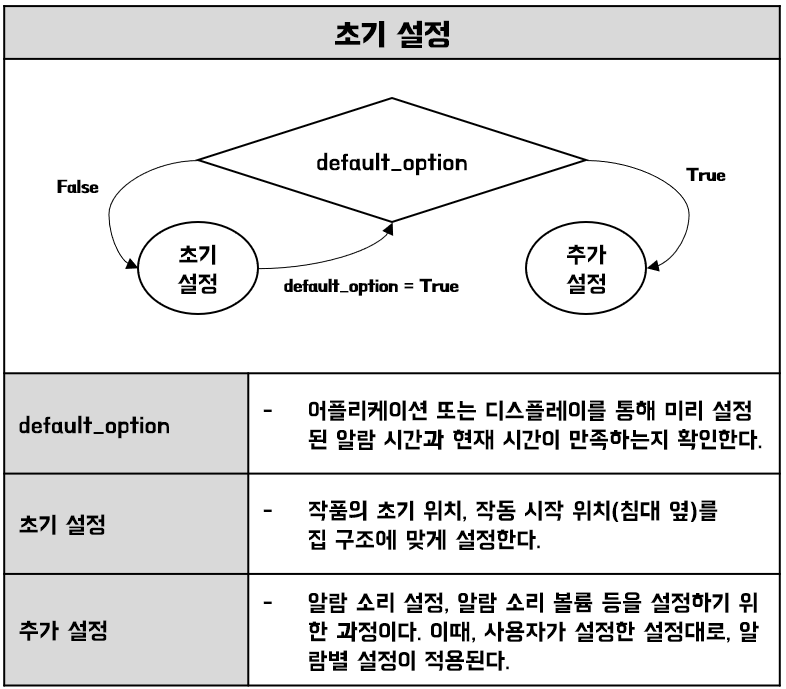
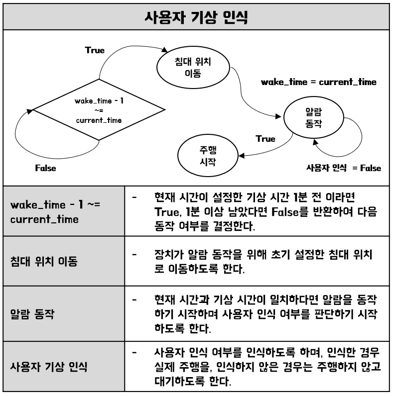
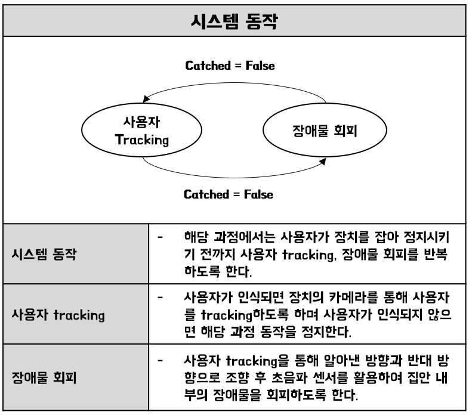
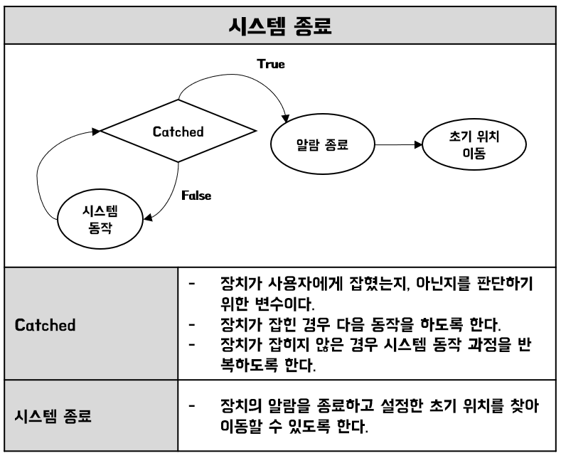

# Embedded_System_2024
  Konkuk Univerity
  <br>
  Team_tenten
  <br>


## 🔖 Intro
Speed Wakegon은 사용자의 확실한 기상을 도와주는 알람시계와 AI 로봇을 결합한 기상 보조 로봇입니다. 

## 💡 Inspiration
현대 사회에서 시간 관리는 필수적이며, 시간 관리의 시작은 정확한 기상 시간에서 비롯됩니다.
휴대폰의 알람이 다양한 기능을 많이 제공하다 하더라도 알람을 끄고 다시 잠에 드는게 현실입니다.
따라서, 저희는 관점을 바꿔 하드웨어적으로 쉽게 끌 수 없는 알람을 만들기로 했습니다.

또한, 기기는 고양이의 모습을 본떠 사용자로 하여금 친근한 이미지를 나타내고자 합니다.

## 📸 Overview

  #사진 넣기

## 👀 Main feature
### 1️⃣ AI 모델로 사용자 인식
  <br>
  인공지능 학습을 통해 human detection을 수행하는 AI 모델을 생성한다. Tensorflow Lite 딥러닝 프레임워크를 사용하여 직접 신경망 학습을 진행하였습니다. 
  사람의 전신을 인식하여야 하기 때문에 cctv를 통해 수집된 데이터셋을 사용하였습니다. 따라서 다양한 각도에서 바라본 다량의 사람 이미지를 학습시켜 일부가 장애물에 의해 보이지 않는 상황에서도 높은 인식률을 갖도록 만듭니다. 또한, 로봇이 빠르게 동작하기 위해서 간단하고 가벼운 네트워크인 SSD-MobileNet v2를 이용하여 모델을 생성하였습니다.
       
### 2️⃣ 디바이스 동작
  - #### 전체 흐름도
    
    
  - #### 1. 초기 설정
    
    
  - #### 2. 사용자 기상인식
    
    
  - #### 3. 시스템 동작
    
  
  - #### 4. 시스템 종료
    
    
    
### 3️⃣ 서버 및 프론트
    #### 1. 서버
    
    #### 2. AOS
    
    #### 3. DEVICE UI

## File Architecture
```
Embedded_System_2024
    │ 
    ├── App 
    │    ├── Frontend
    │    |    ├── UI_pages
    │    |    ├── UI_modules
    |    |    ├── viewmodel
    |    |    ├── retrofit
    |    |    ├── navigation
    |    |    └── data
    |    └── Backend
    │          ├── user
    │          |    ├── controller
    |          |    ├── service
    |          |    ├── dto
    |          |    ├── model
    |          |    ├── exception
    |          |    ├── exception_handler
    |          |    ├── repository
    |          |    └── validation
    |          └── device
    │               ├── controller
    |               ├── service
    |               ├── dto
    |               ├── model
    |               ├── exception
    |               ├── exception_handler
    |               ├── repository
    |               └── validation             
    ├── arduino_src   
    |    ├── src
    |    |    └── HW_Control.ino
    |    └──include
    |         ├── Constants
    |         ├── CUP
    |         ├── Queue
    |         ├── StepperMulti
    |         └── Waterpump
    └── python_src    
        ├── UI
        |    ├── src
        |    |    ├── CoffeeBara.html
        |    |    ├── CoffeeBara.css
        |    |    └── CoffeeBara.js
        |    └── images
        └── main
            ├── model.pth
            └── main.py
```


## Video


