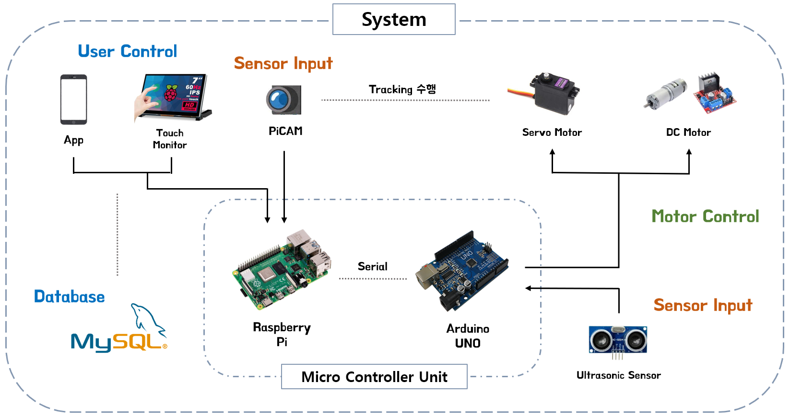
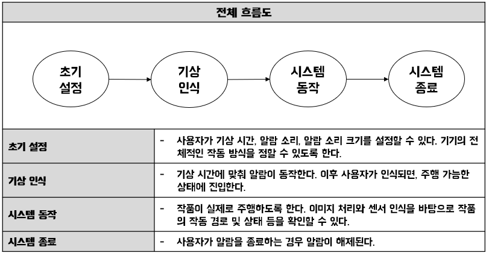
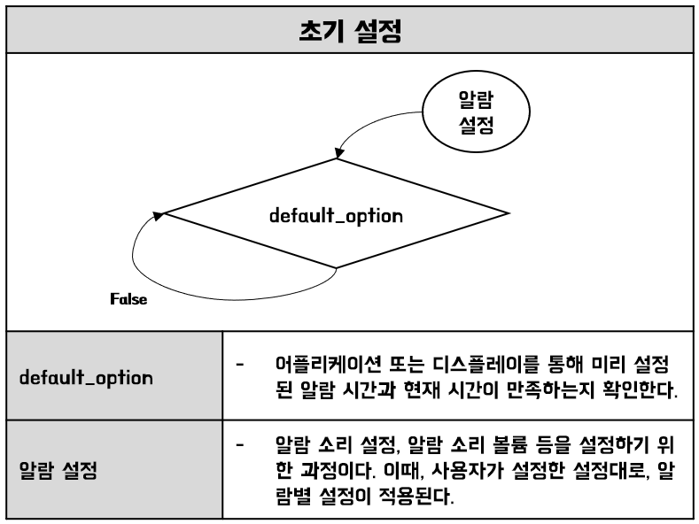
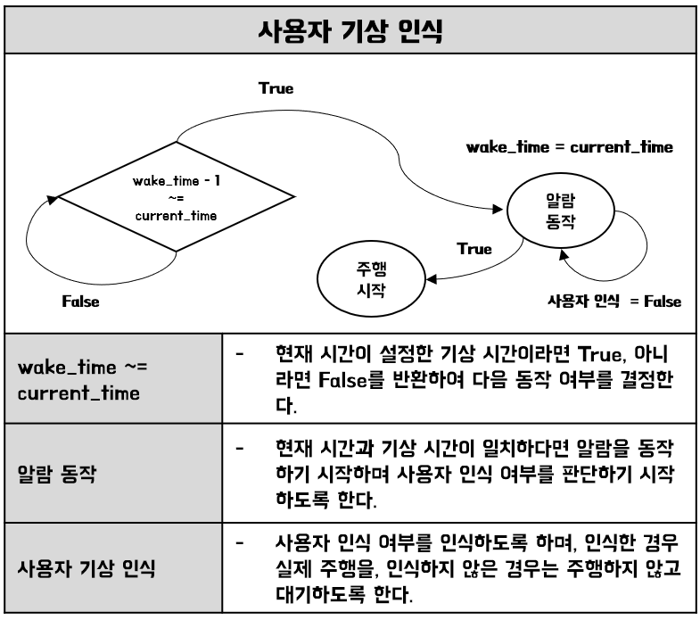
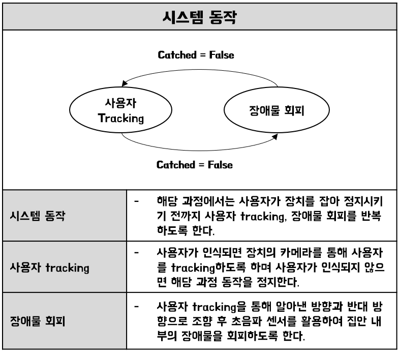
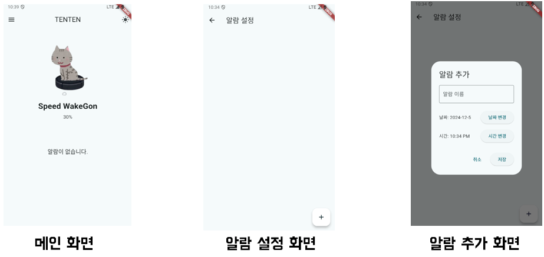
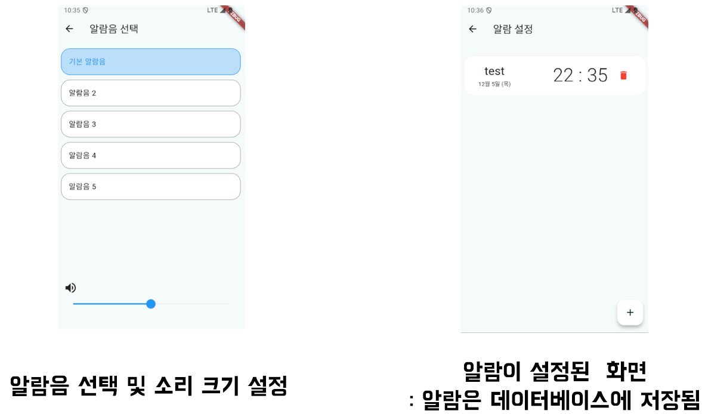
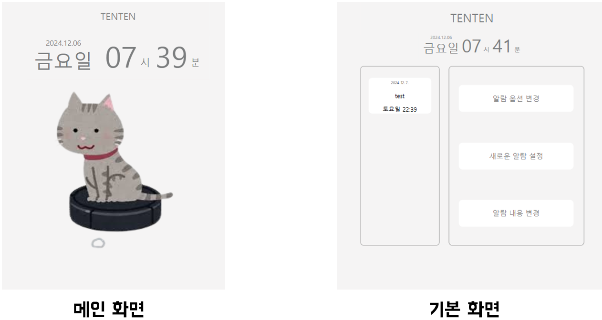
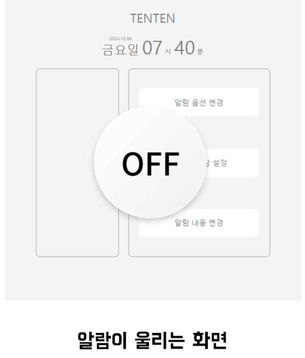

# Embedded_System_2024
  Konkuk Univerity
  <br>
  Team_tenten
  <br>


## 👩‍💻 Intro
Speed Wakegon은 사용자의 확실한 기상을 도와주는 알람시계와 AI 자율주행을 결합한 기상 보조 로봇입니다. 

## 💡 Inspiration
현대 사회에서 시간 관리는 필수적이며, 시간 관리의 시작은 정확한 기상 시간에서 비롯됩니다.
휴대폰의 알람이 다양한 기능을 많이 제공하다 하더라도 알람을 끄고 다시 잠에 드는게 현실입니다.
따라서, 저희는 관점을 바꿔 하드웨어적으로 쉽게 끌 수 없는 알람을 만들기로 했습니다.

또한, 기기는 고양이의 모습을 본떠 사용자로 하여금 친근한 이미지를 나타내고자 합니다.

## 📸 Overview
  
  전체 시스템은 크게 2개의 Controller Unit이 제어합니다.
  
  ### 🍓 Raspberry Pi 4  
  사용자 서비스 영역인 디바이스, 어플리케이션을 관리하는 서버와 연결되어 있으며, 서버 동작에 따른 기능을 수행합니다.
  또한 사용자를 인식하고, 사용자의 방향 정보를 얻어오는 Computer Vision 가능을 수행합니다.
  
  ### ♾ Arduino UNO
  아두이노는 모터 제어 기능을 담당하며 2개의 모터를 제어합니다. 
  사용자가 항상 카메라에 중앙에 오도록 하는 서보모터와, 로봇의 주행을 담당하는 DC 모터를 제어합니다.

  <br>
  <br>

## 🎯 Main feature
### 1️. AI 모델로 사용자 인식
  <br>
  인공지능 학습을 통해 human detection을 수행하는 AI 모델을 생성하였습니다. 임베디드 환경에서의 동작을 위한 비교적 가벼운 tflite 파일을 사용합니다. 
  사람의 전신을 인식하여야 하기 때문에 cctv를 통해 수집된 데이터셋을 사용하였고, 따라서 다양한 각도에서 바라본 다량의 사람 이미지를 학습시켰기에 신체의 일부가 장애물에 의해 보이지 않는 상황에서도 높은 인식률을 갖도록 만들었습니다. 
       
### 2️. 디바이스 동작
#### 전체 흐름도 
  
    
#### 초기 설정
  
    
#### 사용자 기상인식
  
    
#### 시스템 동작
  
  
#### 시스템 종료
  
    
    
### 3️. 사용자 서비스 영역

#### App


어플리케이션을 통해 알람을 설정할 수 있습니다. 알람음, 알람 소리의 크기, 알람 날짜와 시간을 직접 설정할 수 있으며 설정된 알람 목록을 볼 수 있습니다.  
알람을 설정한 뒤에도 알람 목록에서 편집 기능을 통해 알람 수정 및 삭제 가능합니다.

    
#### Device


알람이 울리기 시작하면, 로봇의 디스플레이 화면에 "OFF" 버튼이 표시됩니다. 사용자가 해당 버튼을 눌러 알람을 끄는 것이 시스템 종료 조건입니다.
사용자는 디스플레이를 통해 알람을 끄게 되며, 디스플레이를 통해 새로운 알람을 설정하거나 삭제하는 간단한 동작 또한 수행 가능합니다. 

    

## File Architecture
```
Embedded_System_2024
    │ 
    ├── App 
    │    ├── Frontend
    │    |    ├── UI_pages
    │    |    ├── UI_modules
    |    |    ├── viewmodel
    |    |    ├── retrofit
    |    |    ├── navigation
    |    |    └── data
    |    └── Backend
    │          ├── user
    │          |    ├── controller
    |          |    ├── service
    |          |    ├── dto
    |          |    ├── model
    |          |    ├── exception
    |          |    ├── exception_handler
    |          |    ├── repository
    |          |    └── validation
    |          └── device
    │               ├── controller
    |               ├── service
    |               ├── dto
    |               ├── model
    |               ├── exception
    |               ├── exception_handler
    |               ├── repository
    |               └── validation             
    ├── arduino_src   
    |    ├── src
    |    |    └── HW_Control.ino
    |    └──include
    |         ├── Constants
    |         ├── CUP
    |         ├── Queue
    |         ├── StepperMulti
    |         └── Waterpump
    └── python_src    
        ├── UI
        |    ├── src
        |    |    ├── CoffeeBara.html
        |    |    ├── CoffeeBara.css
        |    |    └── CoffeeBara.js
        |    └── images
        └── main
            ├── model.pth
            └── main.py
```


